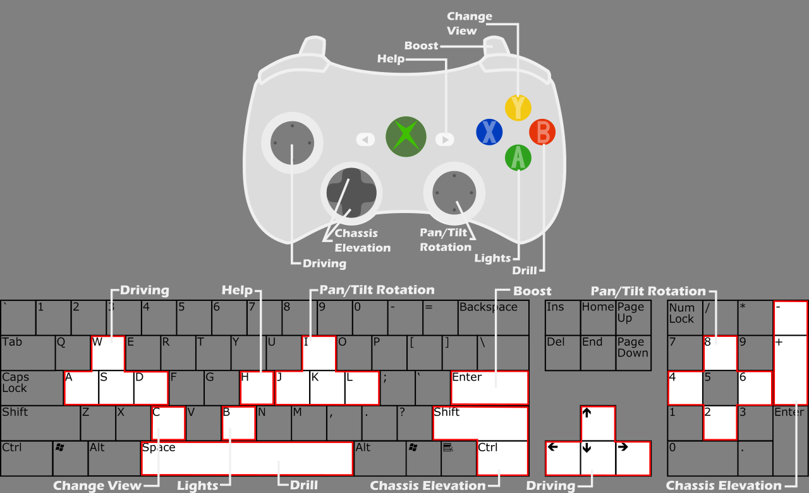

# LUVMI_rover_simulation

Small application for the [LUVMI project](https://www.luvmi.space/) . You can control with keyboard, or gamepad (all is set for a Xbox controller, other controllers may have different mapping).

## WebGL

Tested with Firefox 56.0 32-bit.
For the sake of performances, the quality of the web version is less than the desktop application.

## Controls

## Contact

If you find any problem in these applications, please contact:
Joseph Salini: jsa@spaceapplications.com

Enjoy!
